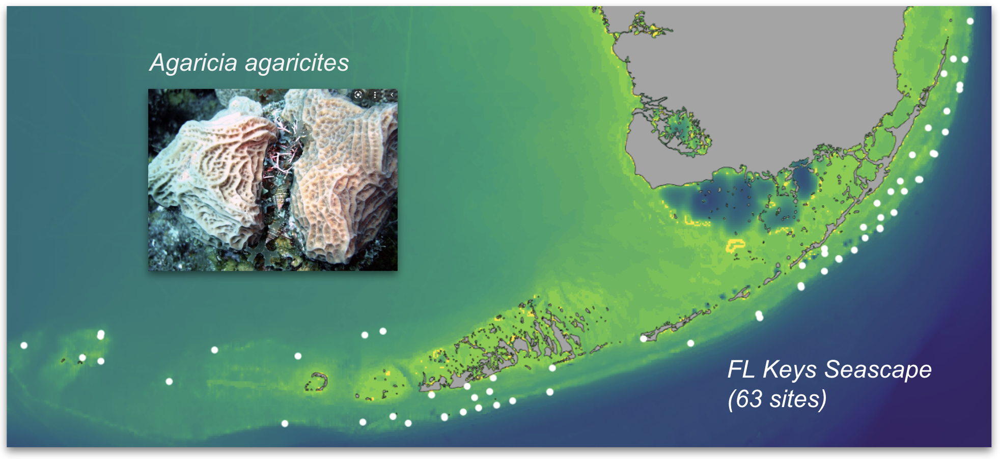
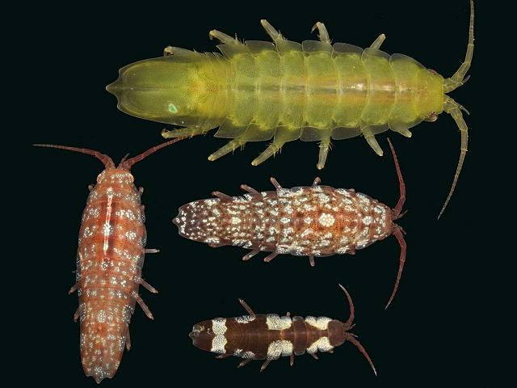

# Introduction to seascape/landscape genomics
#### - exploring and displaying population structure on a map
#### - finding genotype-environment associations
#### - mapping divergent adaptation
####  

## Installing stuff

These exercises are exclusively in R. If you are completely unfamiliar with R, consider working through chapters 1-7 here: http://swcarpentry.github.io/r-novice-gapminder/

First, [install R and Rstudio](https://rstudio-education.github.io/hopr/starting.html), unless you have it already.

The exercises will require quite a few R packages; so open the file *`trarno2023_installations.R`* in Rstudio and follow it. Some of the packages might require additional persuasion to install, so make sure to DO THIS BEFORE THE CLASS.

First, install **devtools**. 
```R
install.packages("devtools")
```
This may require additional installations outside R. Hopefully they will happen automatically, if not, see [here](https://www.r-project.org/nosvn/pandoc/devtools.html).
Then:
```R
# for multivariate analysis:
install.packages(c("vegan","dplyr","raster","fields","ggplot2","pheatmap"))

# for maps:
install.packages(c("remotes","cowplot", "googleway", "ggrepel", "ggspatial","libwgeom", "sf", "rnaturalearth", "rnaturalearthdata"))
remotes::install_github("ropensci/rnaturalearthhires")
install.packages("rnaturalearthhires", repos = "https://ropensci.r-universe.dev", type = "source")

# tess3r: for making admixture maps
devtools::install_github("bcm-uga/TESS3_encho_sen")
```
This one is going to be the trickiest:
```R
install.packages("gradientForest", repos="http://R-Forge.R-project.org")
```
If this one fails, chances are, you need to install **gfortran** first, FOR YOUR SYSTEM from here:
https://gcc.gnu.org/wiki/GFortranBinaries or, for Mac, https://github.com/fxcoudert/gfortran-for-macOS/releases
On a Mac you would also need to point your Rstudio compiler to the location **gfortran** is installed at, by creating/modifying the file *~/.R/Makevars*. The following spell in **Terminal** should work:
```sh
echo "FC = /usr/local/bin/gfortran
F77 = /usr/local/gfortran
FLIBS = -L/usr/local/gfortran/lib" >> ~/.R/Makevars
```
To check if everything was intalled correctly, do this in Rstudio and see if all packages are loaded without errors.

```R
library(tess3r)
library(vegan)
library(ggplot2)
library(sf)      
library(rnaturalearth)
library(rnaturalearthdata)
library(gradientForest)
library(dplyr)
library(raster)
library(fields)
library(maps)
```
If some packages are still missing, try *install.packages( "[package name]" )* command in Rstudio again. If it fails, on a Mac, try opening Termial, saying "R" in command-line, and repeating the *install.packages* commands after you see the R prompt. If that fails too, create a github issue here.

## Seascape genomics of *Agaricia agaricites* in the FL Keys
###
This dataset is from the seascape genomics project led by Kristina Black, who put together many of the analyses I am going to show you. It contains 250 samples of the stony coral *Agaricia agaricites* collected from 63 sites in Florida. 

The samples were sequenced with 2b-RAD, genotyped [de-novo](https://github.com/z0on/2bRAD_denovo) and genetic distances between samples were computed in [ANGSD](http://www.popgen.dk/angsd/index.php/ANGSD) as identity-by-state (IBS) based on single-read resampling. The ADMIXTURE clusters were delineated using [ngsAdmix](http://www.popgen.dk/software/index.php/NgsAdmix).

>We recommend *PCAngsd* for ADMIXTURE analysis these days. That method also computes SNP covariance matrix that can be converted into correlations and used instead of the IBS matrix. We prefer IBS since it is the most assumption-free approach to computing genetic distances, robust to variation in coverage across samples.

There are also environmental data for these same sites, as well as for the whole region. Some of these data come from satellite measurements (temperature, salinity, turbidity, chlorophyll), other data - from [SERC Water Quality Monitoring Network](http://serc.fiu.edu/wqmnetwork/).
###
The script *`Agaricia_tjarno2023.R`* shows how to:
- explore the data and remove problematic samples (functions *hclust*, *pheatmap*, *cutree*)
- plot isolation-by-distance graph to see if there are multiple clines, signifying distinct genetic clusters
- explore genetic structure using principal coordinate analysis (PCoA, function *capscale*), plot ADMIXTURE bar chart using package *tess3R*, and color the PCoA ordination plots according to ADMIXTURE cluster assignments.
- project ADMIXTURE clusters on the map (package *tess3r*) to see where cluster representatives are predominantly found
- perform a gradient forest analysis of genotype-environment associations (package *gradientForest*)
- predict and map areas of divergent adaptation across the whole region.

After going through *`Agaricia_tjarno2023.R`*, you will be asked to investigate adaptation *within* each of the three distinct *A.agaricites* lineages and compare them, all on your own. The script has some scrap code in the end that will be helpful.

## *Idotea baltica* dataset
###
*Idotea baltica* is a small, extremely cute isopod found on *Fucus* algae in the intertidal. The Baltic-wide 2b-RAD genotypoing dataset for this charismatic microfauna representative has been generated by our host, Pierre De Wit. 



Unlike corals, *I. baltica* has very small dispersal range (it is a marsupial carrying its young in the pouch, believe it or not). Because of this, it shows strong isolation-by-distance, and makes the most spectacular ADMIXTURE-on-map plot (let's make one!). But does it also adapt genetically to the variation in conditions across the Baltic sea? Gradient forest to the rescue! We only have a few environmental variables for this creature (temperature and salinity in summer and in winter, so we can have those plus their difference - the yearly temperature range), but it should be enough for the start.

> Hint 1: The GF analysis must be conditional on the strong genetic structure due to isolation-by-distance. This structure is likely to be captured by the fist few principal coordinates.

>Hint 2: Remove SYL population for GF analysis, they are just too different from the rest (this population is outside the Baltic). There are also genotyping replicates that will look like clones in the *hclust* tree - you know what to do with them.

Data for *I. baltica*:
- `bams5`: list of input file names in the order in which they appear in all other data tables. Use them as sample names (just remove the useless *.real.recal.bam* from them using R function *sub*)
- `idotea5.ibsMat`: IBS (genetic distances) matrix
- `Idotea environment 171005.csv`: longitude, latitude, temperature and salinity in winter and summer
- `Baltic_polygon.txt`: table containing longitude and latitude of points defining the Baltic polygon (for plotting ADMIXTURE clusters on map)
- `idotea600_k7.qopt`: ADMIXTURE result with K=7 clusters.

